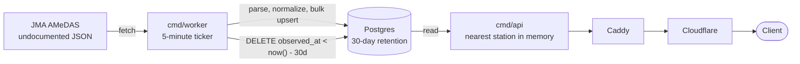

# jma-weather-api

A weather API for Japan. Every five minutes it pulls AMeDAS observations from
the Japan Meteorological Agency (JMA), keeps 30 days of them, and serves them
by latitude and longitude.

Live at <https://api.tenkinow.com>. The site is at <https://tenkinow.com>.
Source: <https://github.com/desmondhiew00/jma-weather-api>.

```console
$ curl -s 'https://api.tenkinow.com/v1/weather/latest?lat=35.69&lon=139.70'
```

> **出典：気象庁ホームページ** (https://www.jma.go.jp/)
>
> Weather data comes from the Japan Meteorological Agency under the
> [Government of Japan Public Data License v1.0](https://www.jma.go.jp/jma/kishou/info/coment.html)
> (compatible with CC BY 4.0). This is not an official JMA product. The data is
> normalized and reshaped, not served as JMA publishes it.

> [!WARNING]
> JMA's JSON endpoints are undocumented and can change without notice. JMA
> doesn't publish them as an API and asks people not to send inquiries about
> them. If observations stop showing up, check the parser in `internal/jma`
> first. `/healthz` returns 503 once ingestion stalls, so stale data doesn't
> get served as current.

## API

Interactive docs: <https://api.tenkinow.com/v1/docs>. The OpenAPI spec is at
<https://api.tenkinow.com/v1/openapi.yaml> and in the repo at
`internal/api/openapi.yaml`.

### `GET /v1/weather/latest?lat=&lon=`

The newest observation from the station nearest the coordinate.

```console
$ curl -s 'https://api.tenkinow.com/v1/weather/latest?lat=35.69&lon=139.70' | jq
{
  "station": {
    "id": "44132",
    "name": "東京",
    "name_en": "Tokyo",
    "lat": 35.69167,
    "lon": 139.75,
    "altitude_m": 25,
    "distance_km": 4.53
  },
  "observation": {
    "observed_at": "2026-09-11T15:50:00Z",
    "temp_c": 19,
    "humidity_pct": 82,
    "pressure_hpa": 1008.4,
    "wind_ms": 2.1,
    "wind_direction_deg": 225,
    "precipitation_10m_mm": 0,
    "precipitation_1h_mm": 0,
    "precipitation_3h_mm": 0,
    "precipitation_24h_mm": 0,
    "sun_10m_min": 0,
    "sun_1h_h": 0,
    "snow_cm": null,
    "visibility_m": null
  },
  "attribution": {
    "publisher": "Japan Meteorological Agency",
    "url": "https://www.jma.go.jp/",
    "notice_ja": "出典：気象庁ホームページを加工して作成（編集責任：tenkinow）"
  }
}
```

If you leave out `lat` and `lon`, the API uses the caller's location from
Cloudflare's visitor location headers. That way a browser that won't share its
location still gets an answer. Every coordinate endpoint returns the coordinate
it used and where it came from:

```json
"coordinate": {"lat": 35.6895, "lon": 139.6917, "source": "network"}
```

`source` is `query` or `network`. IP geolocation is city-level at best and wrong
behind a VPN, which is why the response labels it. This needs the "Add visitor
location headers" managed transform turned on in Cloudflare. Without it, a
request with no coordinate gets a 400. Spoofing the headers gets you nothing
you couldn't already do by passing `lat` and `lon`.

### `GET /v1/weather/history?lat=&lon=&from=&to=`

Observations in a time range. `from` and `to` are required RFC3339 timestamps.
If `from` is older than the retention window, it's moved up to the start of the
window without an error. `retention_days` in the response tells you when that
happened.

```console
$ curl -s 'https://api.tenkinow.com/v1/weather/history?lat=35.69&lon=139.70&from=2026-09-11T00:00:00Z&to=2026-09-11T06:00:00Z'
```

### `GET /v1/weather/at?lat=&lon=&at=`

The observation that was current at a given moment. JMA publishes every ten
minutes, so `at` is rounded down: asking for 14:23 returns the 14:20 reading,
never 14:30. The response includes both the time you asked for and the real
`observed_at`. Returns 404 if there's no reading in the 30 minutes before.

### `GET /v1/weather/now`

The latest reading from every station in one response. The map page uses this.
There's no coordinate, so entries have no `distance_km`.

```console
$ curl -s 'https://api.tenkinow.com/v1/weather/now' | jq '{observed_at, count}'
{
  "observed_at": "2026-09-11T15:50:00Z",
  "count": 1287
}
```

Stations whose newest reading is over 30 minutes old are left out, so `count`
changes between calls. Each entry has its own `observed_at`. The top-level
`observed_at` is the newest of them.

### `GET /healthz`

`200` if the newest stored observation is under 30 minutes old, `503` if not.
It also reports the running commit:

```json
{"status": "ok", "sha": "abc1234", "observed_at": "2026-09-11T15:50:00Z"}
```

### Conventions

- Units are in the field names.
- Wind direction is in degrees, converted from JMA's 1–16 compass index. JMA's `0` (calm) becomes `null`.
- A measurement is `null` if the station doesn't record it or the reading had a bad quality flag. The key is always present.
- Timestamps are RFC3339 UTC. JMA publishes in JST, and we convert on ingest.
- A coordinate maps to the nearest station, named in the response with its `distance_km`. If the nearest one is over 100 km away (offshore or outside Japan), you get a 404.
- Errors look like `{"error": "..."}` with a normal HTTP status code.
- Every response sends `Access-Control-Allow-Origin: *`, so browsers can call it directly.

## How it works

Two Go binaries share one Postgres database.



Each tick, the worker fetches `latest_time.txt` (25 bytes) and compares it with
the newest `observed_at` in the database. AMeDAS updates every ten minutes, so
about half the ticks stop there. When there's new data, one request fetches all
~1,300 stations and one `INSERT ... ON CONFLICT DO UPDATE` writes them. Because
it's an upsert, re-running a tick is harmless and JMA's corrections overwrite
the old values.

The same tick deletes rows older than 30 days. It goes by the wall clock, not
the newest observation, so a JMA outage doesn't stop deletion.

| Package | What's in it |
| --- | --- |
| `internal/domain` | The data model and the `ObservationProvider` interface. JMA's quirks (`[value, flag]` pairs, JST, `[deg, min]` coordinates) stay inside `internal/jma`, so adding another provider doesn't touch the worker or API. |
| `internal/jma` | HTTP client and parser, tested against real snapshots in `internal/jma/testdata`. |
| `internal/repository` | Database reads generated by sqlc. The two bulk upserts are hand-written because sqlc can't type multi-argument `unnest` without a live database. |
| `internal/worker` | The ticker, ingestion and retention. |
| `internal/api` | HTTP handlers and JSON payloads. |

## Running locally

You need Go 1.27+ and Docker.

```console
make up            # Postgres in Docker, host port 5433
make run-worker    # runs migrations, then ingests; leave it running
make run-api       # serves on :8080

curl -s 'localhost:8080/v1/weather/latest?lat=35.69&lon=139.70' | jq
```

Start the worker first. The API loads the station list at startup and exits
with `no stations stored: run the worker first` if there isn't one.

```console
make test          # all tests; repository tests start Postgres with testcontainers
make test-short    # skips tests that need a database
make lint
make check         # sqlc diff + lint + test, same as CI
make sqlc          # regenerate after editing internal/repository/query.sql
```

## Website

`web/` is the site at tenkinow.com, built with Astro as static pages. English
is at `/`, Japanese at `/ja`. It has a landing page that shows the visitor's
nearest station live, a map of every station, and a playground for building API
requests.

```console
$ cd web && pnpm install && pnpm dev     # http://localhost:4321
```

By default it calls the deployed API. To use a local `go run ./cmd/api`, copy
`web/.env.example` to `web/.env` and set `PUBLIC_API_BASE`. You can also add
`?api=<url>` to any page to point it somewhere else.

The map needs a Google Maps JavaScript API key in `GOOGLE_MAP_API`. It's baked
into the page at build time, so anyone can see it. Restrict it by HTTP referrer
in the Google Cloud console.

## Deploying

See [deploy/README.md](deploy/README.md).

## Not built, on purpose

- **Forecasts.** They need a different schema and update cadence, and Japan's Meteorological Service Act restricts them.
- **Historical backfill.** It would take about 31,000 requests to an undocumented endpoint with no auth.
- Authentication, in-app rate limiting, aggregation, pagination, table partitioning and PostGIS.

## License

Code is [MIT](LICENSE). Weather data belongs to JMA under the terms above.
